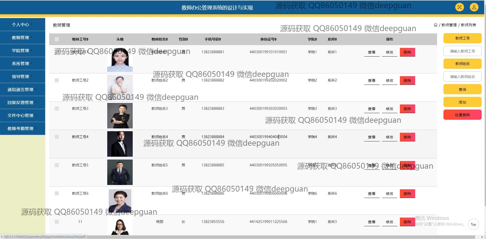
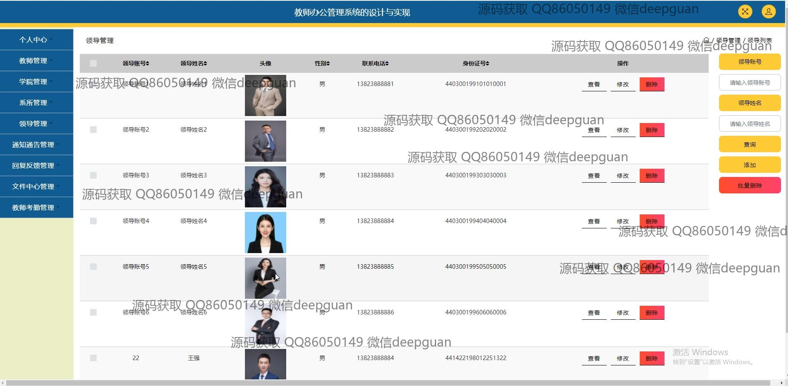

<h1 align="center">教师办公管理系统的设计与实现+jsp</h1>

## 简介
教师办公管理系统：角色分为管理员、教师、领导；功能涵盖教师考勤、通知公告管理、文件上传下载、反馈回复、领导信箱管理，简化信息管理和日常办公流程，提高工作效率。    --计算机毕业设计源码；毕设源码；java毕业设计源码

## 联系方式

<h3 align="center">获取完整代码与数据库文件 + 微信：deepguan QQ: 86050149 QQ群: 783742310</h3>

<h3 align="center">可帮忙远程部署 包运行成功！提供远程部署、修改代码、设计文档指导、代码讲解等服务！</h3>

## 功能介绍（完整见运行截图）
教师： 主要功能包括个⼈中心、通知公告管理、回复反馈管理、⽂件中心管理、考勤管理及信件管理等。教师可以通过系统填写和管理通知，查看和提交反馈，参与考勤登记，记录签到信息并上传相关文件。此外，教师可在信件管理模块中发送或接收信件，与领导交流。

管理员： 系统的管理者角色负责管理教师信息、学院及系所信息，并对考勤记录进行审核和管理。管理员还能处理系统中通知公告、文件中心、回复反馈以及领导信箱等功能模块，通过系统提供的增删改查功能来维护和优化办公系统的使用。

领导： 领导角色侧重于收到和管理信件、处理意见反馈以及查看系统中教师及学院的各类信息。通过信件管理模块，领导可以接收来自教师的信件，并进行审核和回应，确保信息的有效传达与处理。同时，领导也具备查看和管理考勤记录及各类文件的权限。

学生： 系统对学生角色的功能未明确描述，应着重于与教师或系统平台的互动，例如反馈提交、文件查看、以及接收通知等辅助性功能，支持学生在系统中与教师交流及获取信息。

## 运行截图

本代码来源于网络,仅供学习参考使用!

